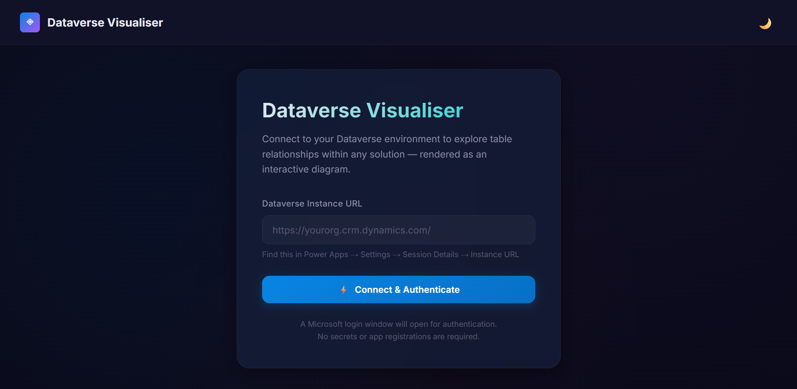
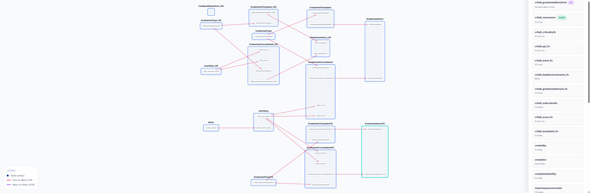

# Dataverse Visualizer

A standalone desktop application for visualizing Microsoft Dataverse table relationships. It allows users to authenticate securely on their local machine, upload Dataverse solutions, and interactively explore table connections, granular column-to-column mappings, and detailed metadata.

## Running as a Desktop App

You can package this application into a standalone native application using PyInstaller.

0. Create your venv: `python -m venv venv`, then run `./venv/Scripts/activate`.
1. Ensure dependencies are installed in your virtual environment (`pip install -r requirements.txt`).
2. Run the build script for your operating system:
   - **Windows (PowerShell)**: `.\build.ps1`
   - **macOS / Linux (Bash)**: `chmod +x build.sh` then `./build.sh`
3. The standalone application will be generated in the `dist` folder:
   - On **Windows**, you will find `dist/Dataverse Visualiser/Dataverse Visualiser.exe`.
   - On **macOS**, you will find a native `Dataverse Visualiser.app` bundle in `dist`.

Simply double-click the `.exe` or `.app` to launch the application.

## Demo

### Landing Page

### Display

